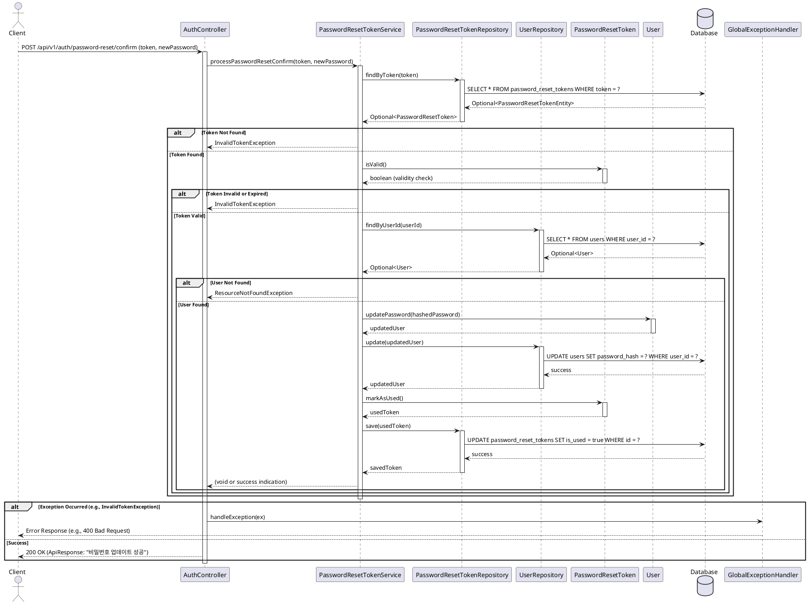

# API 설계: 비밀번호 재설정 확인 (POST /auth/password-reset/confirm)

## 1. 개요

-   **목표**: 사용자가 이메일로 받은 재설정 토큰과 새 비밀번호를 제출하여 비밀번호를 변경할 수 있도록 합니다.
-   **엔드포인트**: `POST /api/v1/auth/password-reset/confirm`
-   **HTTP 메소드**: `POST`
-   **인증**: 불필요
-   **관련 PRD**: FR-ACC-003
-   **API 명세서 참고**: `POST /auth/password-reset/confirm`

## 2. 요청 DTO (Request DTO)

**파일명**: `com.jgji.daily_condition_tracker.domain.auth.presentation.dto.PasswordResetConfirmRequest.java`

```java
package com.jgji.daily_condition_tracker.domain.auth.presentation.dto;

import jakarta.validation.constraints.NotBlank;
import jakarta.validation.constraints.Size;

public record PasswordResetConfirmRequest(
        @NotBlank(message = "토큰은 필수입니다.")
        String token,

        @NotBlank(message = "새 비밀번호는 필수입니다.")
        @Size(min = 8, max = 20, message = "비밀번호는 8자 이상 20자 이하로 입력해야 합니다.")
        // 비밀번호 정책 관련 추가 어노테이션 고려 (예: 정규식)
        String newPassword
) {
}
```

## 3. 응답 (Response)

-   성공 시: `ResponseEntity<ApiResponse<Void>>`
    -   HTTP 상태 코드: `200 OK`
    -   `ApiResponse` 내용:
        -   `code`: 200
        -   `status`: "SUCCESS"
        -   `message`: "비밀번호가 성공적으로 업데이트되었습니다." (API 명세서: "Password updated successfully.")
        -   `data`: null
-   실패 시 (예: 유효하지 않은 토큰, 만료된 토큰):
    -   HTTP 상태 코드: `400 Bad Request` (API 명세서 기준, 또는 `401 Unauthorized` / `404 Not Found`도 고려 가능)
    -   `ApiResponse` 내용:
        -   `code`: 400
        -   `status`: "FAILURE" 또는 "VALIDATION_ERROR"
        -   `message`: "유효하지 않거나 만료된 토큰입니다." 또는 "비밀번호 재설정에 실패했습니다."
        -   `data`: null

## 4. Controller (`AuthController.java`에 추가)

**경로**: `com.jgji.daily_condition_tracker.domain.auth.presentation.AuthController.java`

```java
// 기존 AuthController.java 에 추가될 메소드 시그니처 예시
@PostMapping("/password-reset/confirm")
public ResponseEntity<ApiResponse<Void>> confirmPasswordReset(@Valid @RequestBody PasswordResetConfirmRequest request) {
    log.debug("비밀번호 재설정 확인 요청 수신: token={}", request.token());
    passwordResetTokenService.processPasswordResetConfirm(request.token(), request.newPassword());
    log.debug("비밀번호 재설정 확인 처리 완료: token={}", request.token());
    
    return ResponseEntity.ok(
        ApiResponse.<Void>builder()
            .code(HttpStatus.OK.value())
            .status("SUCCESS")
            .message("비밀번호가 성공적으로 업데이트되었습니다.")
            .build()
    );
}
```

**처리 흐름**:
1.  `@Valid` 어노테이션으로 `PasswordResetConfirmRequest` DTO의 유효성을 검사합니다.
2.  `PasswordResetTokenService`의 `processPasswordResetConfirm` 메소드를 호출하여 비즈니스 로직을 수행합니다.
3.  성공적으로 처리되면 HTTP 상태 코드 `200 OK`와 함께 성공 메시지를 담은 `ApiResponse<Void>`를 반환합니다.
4.  토큰이 유효하지 않거나 만료된 경우, `PasswordResetTokenService`에서 예외가 발생하고 `GlobalExceptionHandler`가 이를 처리하여 적절한 오류 응답을 반환합니다.

## 5. Service (`PasswordResetTokenService.java`에 추가)

**경로**: `com.jgji.daily_condition_tracker.domain.auth.application.PasswordResetTokenService.java`

```java
// 기존 PasswordResetTokenService.java 에 추가될 메소드 시그니처 예시
@Transactional
public void processPasswordResetConfirm(String token, String newPassword) {
    // 1. 토큰으로 PasswordResetToken 조회
    PasswordResetToken passwordResetToken = passwordResetTokenRepository.findByToken(token)
            .orElseThrow(() -> new InvalidTokenException("유효하지 않은 토큰입니다."));
    
    // 2. 토큰 유효성 검사 (도메인 로직 활용)
    if (!passwordResetToken.isValid()) {
        throw new InvalidTokenException("유효하지 않거나 만료된 토큰입니다.");
    }
    
    // 3. 사용자 조회
    User user = userRepository.findByUserId(passwordResetToken.getUserId())
            .orElseThrow(() -> new ResourceNotFoundException("사용자를 찾을 수 없습니다."));
    
    // 4. 새 비밀번호 암호화 및 사용자 비밀번호 업데이트 (User 도메인 로직 활용)
    HashedPassword hashedPassword = HashedPassword.create(newPassword); // 암호화 로직이 도메인에 있다고 가정
    User updatedUser = user.updatePassword(hashedPassword);
    userRepository.update(updatedUser);
    
    // 5. 토큰을 사용 완료로 표시 (도메인 로직 활용)
    PasswordResetToken usedToken = passwordResetToken.markAsUsed();
    passwordResetTokenRepository.save(usedToken);
    
    log.debug("비밀번호 재설정 완료: userId={}", user.getUserId());
}
```

**주요 로직**:
1.  제공된 토큰을 사용하여 `PasswordResetToken` 도메인 객체를 조회합니다. 토큰이 존재하지 않으면 `InvalidTokenException`을 발생시킵니다.
2.  `PasswordResetToken` 도메인 객체의 `isValid()` 메소드를 사용하여 토큰 유효성을 검사합니다 (미사용이고 만료되지 않음).
3.  토큰의 `userId`를 사용하여 사용자를 조회합니다.
4.  `User` 도메인 객체의 `updatePassword(HashedPassword hashedPassword) 메소드를 사용하여 새 비밀번호로 업데이트합니다.
5.  `PasswordResetToken` 도메인 객체의 `markAsUsed()` 메소드를 사용하여 토큰을 사용 완료로 표시합니다.
6.  모든 과정은 `@Transactional`로 관리됩니다.

## 6. Repository

-   **`PasswordResetTokenRepository`**: `com.jgji.daily_condition_tracker.domain.auth.infrastructure.PasswordResetTokenRepository`의 기존 메소드들을 활용합니다:
    -   `Optional<PasswordResetToken> findByToken(String token)`: 토큰으로 조회
    -   `PasswordResetToken save(PasswordResetToken passwordResetToken)`: 토큰 상태 업데이트
-   **`UserRepository`**: `com.jgji.daily_condition_tracker.domain.user.infrastructure.UserRepository`의 기존 메소드들을 활용합니다:
    -   `Optional<User> findByUserId(Long userId)`: 사용자 ID로 조회 (새로 추가 필요할 수 있음)
    -   `User update(User user)`: 사용자 정보 업데이트

## 7. 도메인 로직 활용

현재 개발된 `PasswordResetToken` 도메인 객체의 메소드들을 활용합니다:
-   `isValid()`: 토큰이 유효한지 확인 (미사용이고 만료되지 않음)
-   `isExpired()`: 토큰이 만료되었는지 확인
-   `markAsUsed()`: 토큰을 사용 완료로 표시

`User` 도메인 객체의 메소드들을 활용합니다:
-   `updatePassword(HashedPassword hashedPassword)`: 비밀번호 업데이트

## 8. 예외 처리 (`GlobalExceptionHandler.java`에 추가될 수 있는 예외)

-   **`InvalidTokenException`** (Custom Exception)
    -   원인: 제공된 토큰이 DB에 없거나, 만료되었거나, 이미 사용된 경우.
    -   HTTP 상태 코드: `400 Bad Request` 또는 `401 Unauthorized`.
    -   응답 메시지: "유효하지 않거나 만료된 토큰입니다."
    -   `GlobalExceptionHandler`에 핸들러 추가:
        ```java
        @ExceptionHandler(InvalidTokenException.class)
        public ResponseEntity<ApiResponse<Void>> handleInvalidToken(InvalidTokenException ex) {
            return ResponseEntity
                    .status(HttpStatus.BAD_REQUEST)
                    .body(ApiResponse.fail(HttpStatus.BAD_REQUEST.value(), ex.getMessage()));
        }
        ```
-   **`ResourceNotFoundException`**: 사용자를 찾을 수 없는 경우 (기존 예외 활용)
-   **`MethodArgumentNotValidException`**: DTO 유효성 검사 실패 시 (400 Bad Request) - `GlobalExceptionHandler`에서 이미 처리될 것으로 예상.

## 9. 보안 고려 사항

1.  **토큰 검증**: `PasswordResetToken` 도메인 객체의 `isValid()` 메소드를 통해 토큰의 존재 여부, 만료 여부, 사용 여부를 철저히 검증합니다.
2.  **토큰 일회성**: `markAsUsed()` 메소드를 통해 한 번 사용된 토큰은 즉시 무효화하여 재사용을 방지합니다.
3.  **새 비밀번호 정책**: 새 비밀번호는 기존 비밀번호 정책(길이, 복잡성 등)을 만족해야 합니다. 이는 DTO의 `@Size` 등으로 강제합니다.
4.  **HTTPS**: 모든 통신은 HTTPS를 통해 암호화되어야 합니다.
5.  **로그아웃 처리**: 비밀번호 변경 성공 시, 해당 사용자의 다른 모든 활성 세션(존재한다면)을 무효화하는 것을 고려할 수 있습니다. (MVP 범위 초과 가능성)

## 10. 흐름도 (Sequence Diagram - PlantUML)



## 11. 추후 개선 사항
-   이전 비밀번호와 새 비밀번호가 동일한지 확인하는 로직 추가.
-   비밀번호 변경 시 사용자에게 알림 이메일 발송.
-   성공적인 비밀번호 변경 후 자동 로그인 처리 또는 로그인 페이지로 리디렉션 안내.
-   만료된 토큰 정리를 위한 스케줄링 작업 활용 (기존 `PasswordResetTokenRepository`의 `deleteByExpiryDateBefore` 메소드 활용). 