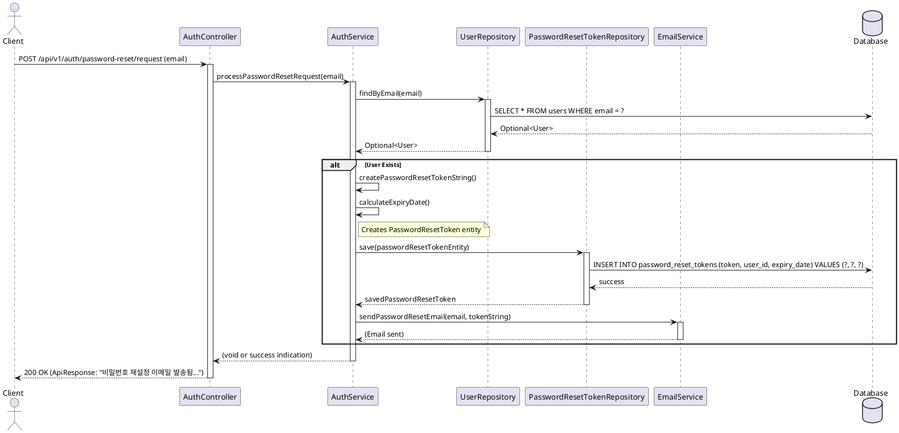

# API 설계: 비밀번호 재설정 요청 (POST /auth/password-reset/request)

## 1. 개요

-   **목표**: 사용자가 이메일 주소를 제출하여 비밀번호 재설정 링크(또는 코드)를 포함한 이메일을 받을 수 있도록 합니다.
-   **엔드포인트**: `POST /api/v1/auth/password-reset/request`
-   **HTTP 메소드**: `POST`
-   **인증**: 불필요
-   **관련 PRD**: FR-ACC-003
-   **API 명세서 참고**: `POST /auth/password-reset/request`

## 2. 요청 DTO (Request DTO)

**파일명**: `com.jgji.daily_condition_tracker.domain.auth.presentation.dto.PasswordResetRequestRequest.java`

```java
package com.jgji.daily_condition_tracker.auth.presentation.dto;

import jakarta.validation.constraints.Email;
import jakarta.validation.constraints.NotBlank;
import jakarta.validation.constraints.Size;

public record PasswordResetRequestRequest(
        @NotBlank(message = "이메일은 필수입니다.")
        @Email(message = "유효한 이메일 형식이 아닙니다.")
        @Size(max = 255, message = "이메일은 최대 255자까지 입력 가능합니다.")
        String email
) {
}
```

## 3. 응답 (Response)

-   성공 시: `ResponseEntity<ApiResponse<Void>>`
    -   HTTP 상태 코드: `200 OK`
    -   `ApiResponse` 내용:
        -   `code`: 200
        -   `status`: "SUCCESS"
        -   `message`: "비밀번호 재설정 이메일이 발송되었습니다. (사용자가 존재하는 경우)" (API 명세서: "Password reset email sent if user exists.")
        -   `data`: null

## 4. Controller (`AuthController.java`에 추가)

**경로**: `com.jgji.daily_condition_tracker.auth.presentation.AuthController.java`

```java
// 기존 AuthController.java 에 추가될 메소드 시그니처 예시
@PostMapping("/password-reset/request")
public ResponseEntity<ApiResponse<Void>> requestPasswordReset(@Valid @RequestBody PasswordResetRequestRequest request) {
    authService.processPasswordResetRequest(request.email());
    // API 명세서에 따라 사용자 존재 유무를 노출하지 않는 메시지 사용
    return ResponseEntity.ok(
        ApiResponse.<Void>builder()
            .code(HttpStatus.OK.value())
            .status("SUCCESS")
            .message("비밀번호 재설정 이메일이 발송되었습니다. (사용자가 존재하는 경우)")
            .build()
    );
}
```

**처리 흐름**:
1.  `@Valid` 어노테이션으로 `PasswordResetRequestRequest` DTO의 유효성을 검사합니다.
2.  `AuthService`의 `processPasswordResetRequest` 메소드를 호출하여 비즈니스 로직을 수행합니다.
3.  성공적으로 처리되면 HTTP 상태 코드 `200 OK`와 함께 성공 메시지를 담은 `ApiResponse<Void>`를 반환합니다. 사용자 존재 여부를 직접적으로 노출하지 않는 메시지를 사용합니다.

## 5. Service (`AuthService.java`에 추가)

**경로**: `com.jgji.daily_condition_tracker.auth.application.AuthService.java`

```java
// 기존 AuthService.java 에 추가될 메소드 시그니처 예시
@Transactional
public void processPasswordResetRequest(String email) {
    // 1. 이메일로 사용자 조회
    Optional<User> userOptional = userRepository.findByEmail(email);
    
    // 2. 사용자가 존재하면 다음 단계 진행 (존재하지 않아도 동일한 응답을 주기 위해 오류를 발생시키지 않음)
    if (userOptional.isPresent()) {
        User user = userOptional.get();
        // 3. 비밀번호 재설정 토큰 생성 (유효기간 포함, 예: UUID, SecureRandom)
        String tokenString = createPasswordResetTokenString(); 
        // 4. PasswordResetToken 엔티티 생성 및 저장
        PasswordResetToken passwordResetTokenEntity = new PasswordResetToken(tokenString, user, calculateExpiryDate(TOKEN_EXPIRATION_TIME_IN_MINUTES));
        passwordResetTokenRepository.save(passwordResetTokenEntity);
        // 5. 사용자 이메일로 비밀번호 재설정 링크/코드 발송 (EmailService 사용)
        emailService.sendPasswordResetEmail(email, tokenString);
    }
    // 사용자 존재 여부에 관계없이 동일한 시간 내에 응답하도록 하여 타이밍 공격 방지 고려.
}

// 토큰 생성 로직 (예시)
private String createPasswordResetTokenString() {
    return UUID.randomUUID().toString();
}

// 만료 시간 계산 로직 (예시)
private LocalDateTime calculateExpiryDate(int minutes) {
    return LocalDateTime.now().plusMinutes(minutes);
}

// 토큰 유효 시간 (분 단위, 예: 60분)
private static final int TOKEN_EXPIRATION_TIME_IN_MINUTES = 60; 
```

**주요 로직**:
1.  입력된 이메일로 사용자를 조회합니다. (`UserRepository` 사용)
2.  사용자가 존재하면,
    a.  안전한 비밀번호 재설정 토큰 문자열(예: UUID)을 생성합니다.
    b.  `PasswordResetToken` 엔티티를 생성하여 토큰, 사용자 ID, 만료 시간을 설정하고, 이를 `PasswordResetTokenRepository`를 통해 데이터베이스에 저장합니다.
    c.  사용자의 이메일 주소로 비밀번호 재설정 링크(프론트엔드 경로 + 토큰) 또는 코드를 포함한 이메일을 발송합니다. (별도의 `EmailService` 인터페이스를 통해 구현)
3.  사용자가 존재하지 않더라도, 동일한 성공 메시지를 반환하여 사용자 계정 존재 유무를 유추할 수 없도록 합니다. (타이밍 공격 방지를 위해 처리 시간도 유사하게 유지하는 것이 좋습니다.)
4.  모든 과정은 `@Transactional`로 관리될 수 있습니다.

## 6. Repository

-   **`UserRepository`**: `com.jgji.daily_condition_tracker.domain.user.UserRepository`의 `findByEmail(String email)` 메소드를 사용하여 사용자 정보를 조회합니다.
-   **`PasswordResetTokenRepository`**: 새로 추가될 `com.jgji.daily_condition_tracker.auth.domain.PasswordResetTokenRepository` 인터페이스와 그 구현체를 통해 `PasswordResetToken` 엔티티를 관리합니다. (예: `save(PasswordResetToken token)`, `findByToken(String token)`)

## 7. 비밀번호 재설정 토큰 관리 (`PasswordResetToken` 엔티티)

-   **엔티티/테이블**: `PasswordResetToken` 엔티티와 이에 매핑되는 `password_reset_tokens` 테이블을 사용하여 토큰 정보를 관리합니다.
    -   `id` (PK, Long, Auto-increment)
    -   `token` (String, Not Null, Unique): 추측 불가능한 랜덤 문자열 (예: `UUID.randomUUID().toString()`)
    -   `user` (User, Not Null, ManyToOne 관계): `users` 테이블의 `id`를 참조하는 외래 키 (`user_id`)
    -   `expiryDate` (LocalDateTime, Not Null): 토큰 만료 시간
-   **토큰**: 충분한 엔트로피를 가진 랜덤 문자열 (예: `UUID.randomUUID().toString()`)을 사용합니다.
-   **만료**: 토큰은 짧은 유효 기간(예: 1시간)을 가져야 합니다. 만료된 토큰은 검증 시 유효하지 않은 것으로 처리됩니다.
-   **정리**: 만료된 토큰은 주기적으로 삭제하는 메커니즘을 고려할 수 있습니다 (예: 스케줄링된 배치 작업).

## 8. 이메일 발송

-   `spring-boot-starter-mail` (버전 `3.5.0` 명시, 실제 프로젝트 적용 시 Spring Boot 버전과의 호환성 확인 필요) 라이브러리를 사용하여 이메일 발송 기능을 구현합니다.
-   별도의 `EmailService` 인터페이스와 그 구현체를 통해 이메일 발송 기능을 담당합니다.
    -   `void sendPasswordResetEmail(String toEmail, String token);`
-   이메일 템플릿에는 비밀번호를 재설정할 수 있는 프론트엔드 URL과 토큰을 포함해야 합니다. (예: `https://your-frontend.com/reset-password?token=YOUR_TOKEN_HERE`)

## 9. 예외 처리 (`GlobalExceptionHandler.java`에 추가될 수 있는 예외)

-   일반적으로 이 API는 사용자에게 성공/실패 여부를 명확히 알리지 않으므로, 내부 로직 실패(예: 이메일 서비스 장애) 시에는 서버 로깅 후 일반적인 성공 응답을 반환하거나, 별도의 모니터링을 통해 처리합니다.
-   `MethodArgumentNotValidException`: DTO 유효성 검사 실패 시 (400 Bad Request) - `GlobalExceptionHandler`에서 이미 처리될 것으로 예상.

## 10. 보안 고려 사항

1.  **토큰 보안**: 추측 불가능하고 일회용인 토큰을 사용합니다. 토큰은 안전하게 전송되어야 합니다 (HTTPS).
2.  **토큰 만료**: 토큰에 짧은 유효 기간을 설정하고, 만료된 토큰은 사용할 수 없도록 합니다.
3.  **사용자 존재 유무 숨김**: API 응답 메시지를 통해 특정 이메일 주소의 가입 여부를 유추할 수 없도록 합니다.
4.  **요청 속도 제한 (Rate Limiting)**: 특정 IP 또는 사용자가 단시간에 너무 많은 비밀번호 재설정 요청을 보내는 것을 방지합니다.
5.  **이메일 내용**: 이메일에는 사용자를 식별할 수 있는 민감 정보(비밀번호 제외)를 최소한으로 포함하고, 어떤 계정에 대한 재설정인지 명시합니다.

## 11. 흐름도 (Sequence Diagram - PlantUML)



## 12. 추후 개선 사항
-   만료된 `PasswordResetToken` 레코드 정리를 위한 스케줄링 작업 구현.
-   이메일 발송 실패 시 재시도 로직 또는 알림.
-   비밀번호 변경 이력 추적 (보안 감사용).

## 13. DDL (`password_reset_tokens` 테이블)

```sql
CREATE TABLE `password_reset_tokens` (
    `id` BIGINT unsigned AUTO_INCREMENT PRIMARY KEY COMMENT '토큰 ID',
    `token` VARCHAR(255) NOT NULL UNIQUE COMMENT '비밀번호 재설정 토큰',
    `user_id` BIGINT unsigned NOT NULL COMMENT '사용자 ID (users 테이블 참조)',
    `expiry_date` TIMESTAMP NOT NULL COMMENT '토큰 만료 일시',
    `created_at` TIMESTAMP NOT NULL DEFAULT CURRENT_TIMESTAMP COMMENT '생성 일시',
    `updated_at` TIMESTAMP NOT NULL DEFAULT CURRENT_TIMESTAMP ON UPDATE CURRENT_TIMESTAMP COMMENT '수정 일시',
    INDEX `idx_token` (`token`),
    INDEX `idx_user_id_created` (`user_id`, `created_at`),
    CONSTRAINT `fk_password_reset_tokens_user_id` FOREIGN KEY (`user_id`) REFERENCES users(`user_id`) ON DELETE CASCADE
) COMMENT '비밀번호 재설정 토큰 테이블';
```